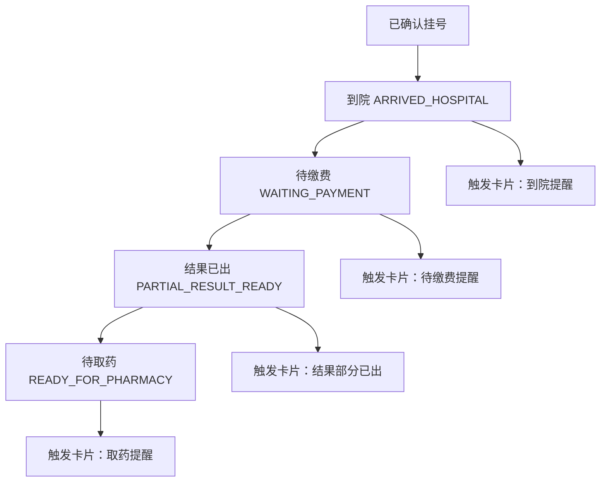

# 状态触发 Demo 说明

这份 Demo 的目标不是模拟完整医院系统，而是证明：

- 就诊状态可以落库
- 状态变化可以触发下一张卡片
- 触发后的提醒可以写入 `chat_messages` 和 `scene_events`

## 这次演示的 4 个关键状态

- `ARRIVED_HOSPITAL`：到院
- `WAITING_PAYMENT`：待缴费
- `PARTIAL_RESULT_READY`：结果已出
- `READY_FOR_PHARMACY`：待取药

## 前端怎么触发

在聊天页进入挂号确认后的后半段，会出现一张 `状态触发 Demo` 卡。

点击任一按钮后，会做 3 件事：

1. 更新当前会话的状态和位置
2. 调用 `encounter-status` 把状态写回 `consultation_sessions`
3. 调用 `scene-push-v2` 生成下一张提醒卡，并把事件写入 `scene_events`

## 状态流转图

## 数据如何落库

### 1. consultation_sessions

记录当前会话的主状态：

- `id`
- `symptom`
- `encounter_status`
- `delegation_mode`
- `updated_at`

### 2. scene_events

记录“这次状态触发过什么事件”：

- `session_id`
- `event_type`
- `encounter_status`
- `location_zone`
- `payload`

### 3. chat_messages

记录“因为状态触发而插入的提醒卡片”：

- `session_id`
- `role`
- `kind`
- `payload`

## 代码位置

- 前端状态控制与触发：
  - `/Users/gujinyu/Documents/Playground/ai医疗问诊/app/index.tsx`
- 前端本地 scene 规则：
  - `/Users/gujinyu/Documents/Playground/ai医疗问诊/lib/sceneEngine.ts`
- Supabase 状态更新函数：
  - `/Users/gujinyu/Documents/Playground/ai医疗问诊/supabase/functions/encounter-status/index.ts`
- Supabase scene push 函数：
  - `/Users/gujinyu/Documents/Playground/ai医疗问诊/supabase/functions/scene-push-v2/index.ts`

## 面试时怎么讲

可以直接用这段：

“为了证明这不是静态原型，我单独做了一个状态触发 Demo。用户进入挂号后的后半段，我可以手动触发到院、待缴费、结果已出、待取药四个关键状态。每次状态变化都会同步更新 session，并由云端 scene-push 生成下一张提醒卡，所以产品是‘状态驱动卡片’，而不是把所有提醒写死在前端。”
